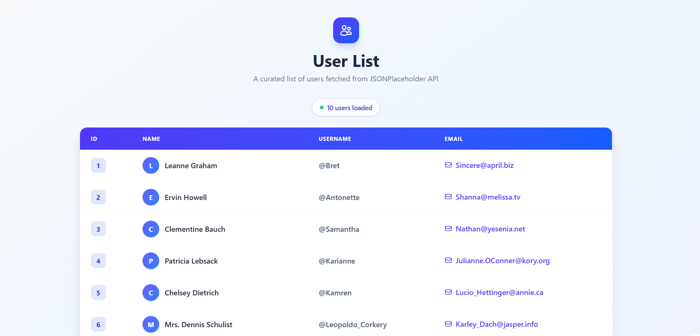
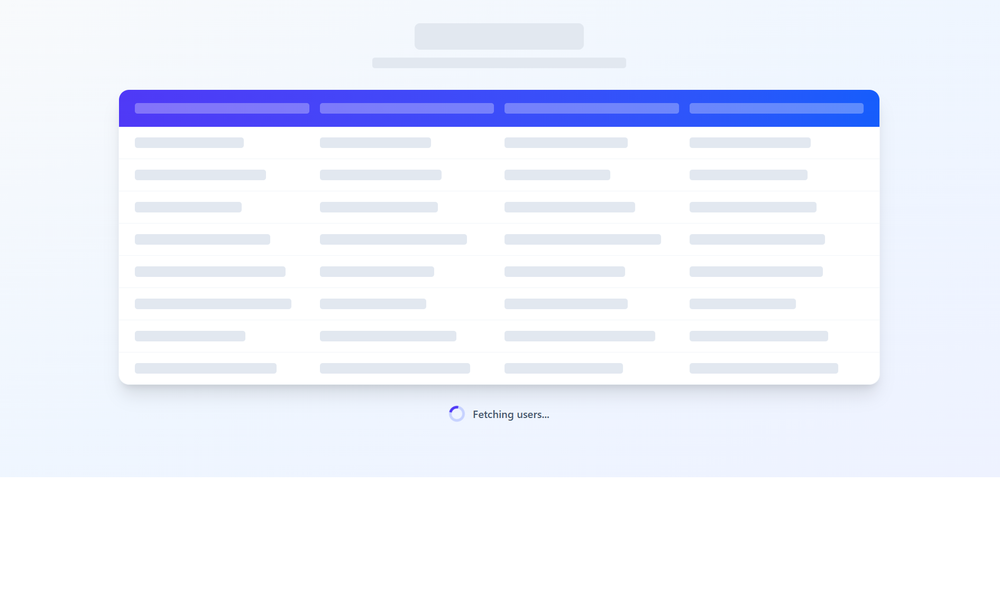
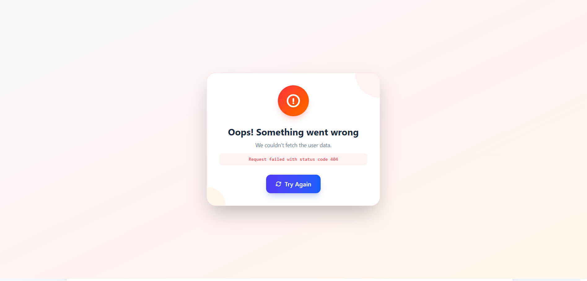

<h1 align="center">📊 React TypeScript Tailwind React Query Axios Table</h1>

<p align="center">
  A modern, fully-typed data table application built with <b>React</b>, <b>TypeScript</b>, <b>Tailwind CSS</b>, <b>React Query</b>, and <b>Axios</b>.
  <br />
  It fetches user data from the <a href="https://jsonplaceholder.typicode.com/" target="_blank">JSONPlaceholder</a> API and displays it in a clean, responsive table.
</p>

<p align="center">
  <a href="https://react-typescript-tailwind-react-que-eosin.vercel.app/" target="_blank">
    
  </a>
</p>

---

## ✨ Features

- ⚡ **Lightning-fast development** with [Vite](https://vitejs.dev/)
- 🎯 **Type-safe** codebase using **TypeScript** with a `User` interface
- 🔄 **Efficient data fetching & caching** with **React Query**
- 🌐 **HTTP requests** handled by **Axios**
- 🎨 **Modern, responsive UI** styled with **Tailwind CSS**
- 📋 **Clean tabular display** of fetched user data
- ⏳ **Animated skeleton loader** for the loading state
- ❌ **Professional error state** with a retry button
- 🧹 **Linting** configured with **ESLint**

---

## 🛠️ Tech Stack

| Technology | Purpose |
|------------|---------|
| [React](https://react.dev/) | UI library |
| [TypeScript](https://www.typescriptlang.org/) | Static typing |
| [Vite](https://vitejs.dev/) | Build tool & dev server |
| [Tailwind CSS](https://tailwindcss.com/) | Styling |
| [React Query](https://react-query.tanstack.com/) | Data fetching & caching |
| [Axios](https://axios-http.com/) | HTTP client |
| [ESLint](https://eslint.org/) | Code linting |

---

## 📁 Project Structure

```
├── public/                  # Static assets
├── screenshots/             # Project screenshots
├── src/
│   ├── App.tsx              # Main app component (data fetching + UI)
│   ├── App.css              # App styles
│   ├── main.tsx             # Entry point (QueryClientProvider setup)
│   └── index.css            # Global styles (Tailwind directives)
├── index.html
├── package.json
├── eslint.config.js
├── tsconfig.json
├── tsconfig.app.json
├── tsconfig.node.json
└── vite.config.ts
```

---

## 🚀 Getting Started

### Prerequisites

Make sure you have the following installed:

- **Node.js** (v18 or higher recommended)
- **npm** (or **yarn** / **pnpm**)

### Installation

1. **Clone the repository**
   ```bash
   git clone https://github.com/mohammadjmweb/React-typescript-tailwind-react-query-axios-table.git
   cd React-typescript-tailwind-react-query-axios-table
   ```

2. **Install dependencies**
   ```bash
   npm install
   ```

3. **Start the development server**
   ```bash
   npm run dev
   ```

4. **Open in browser**
   ```
   http://localhost:5173
   ```

### Build for Production

```bash
npm run build
```

The optimized output will be available in the `dist/` folder.

### Preview Production Build

```bash
npm run preview
```

### Run Linter

```bash
npm run lint
```

---

## 🔌 API Reference

This project consumes the free **JSONPlaceholder** API:

- **Endpoint:** `https://jsonplaceholder.typicode.com/users`
- **Method:** `GET`
- **Response:** Array of user objects

### User Type

```typescript
interface User {
  id: number;
  name: string;
  username: string;
  email: string;
}
```

---

## 🧠 How It Works

The app is split into two main files:

### 1. `src/main.tsx` — Query Client Setup

Sets up a **`QueryClient`** instance and wraps the entire app with **`QueryClientProvider`**, enabling React Query features (caching, refetching, state management) across all components.

```tsx
const queryClient = new QueryClient();

createRoot(document.getElementById('root')!).render(
  <QueryClientProvider client={queryClient}>
    <App />
  </QueryClientProvider>,
);
```

### 2. `src/App.tsx` — Data Fetching & Rendering

- **`fetchUsers`** — an async function that uses **Axios** to fetch users from the JSONPlaceholder API.
- **`useQuery`** — a **React Query** hook that manages fetching, caching, and state (`isLoading`, `error`, `data`).
- **Conditional rendering** — displays an animated skeleton loader, a professional error card with retry, or the user table.
- **Table rendering** — maps over the fetched users to render rows with `id`, `name`, `username`, and `email`.

```tsx
const { data, error, isLoading, refetch } = useQuery<User[], Error>(
  'users',
  fetchUsers,
  { retry: 1, refetchOnWindowFocus: false }
);
```

---

## 📸 Screenshots

### 🖥️ User List Table



### ⏳ Loading State



### ❌ Error State



---

## 🌐 Live Demo

Check out the live version of the project:

<a href="https://react-typescript-tailwind-react-que-eosin.vercel.app/" target="_blank">
  🔗 Live Demo
</a>

---

## 🤝 Contributing

Contributions, issues, and feature requests are welcome!

1. Fork the project
2. Create your feature branch (`git checkout -b feature/AmazingFeature`)
3. Commit your changes (`git commit -m 'Add some AmazingFeature'`)
4. Push to the branch (`git push origin feature/AmazingFeature`)
5. Open a Pull Request

---

## 📄 License

This project is open source and available under the **MIT License**.

---

## 👤 Author

**Mohammad Jm**

- GitHub: <a href="https://github.com/mohammadjmweb" target="_blank">@mohammadjmweb</a>
- Live Demo: <a href="https://react-typescript-tailwind-react-que-eosin.vercel.app/" target="_blank">Live Demo</a>

---

## ⭐ Show Your Support

If you found this project helpful, please give it a ⭐ on GitHub — it means a lot!

---

<p align="center">Made with ❤️ using React, TypeScript & Tailwind CSS</p>
